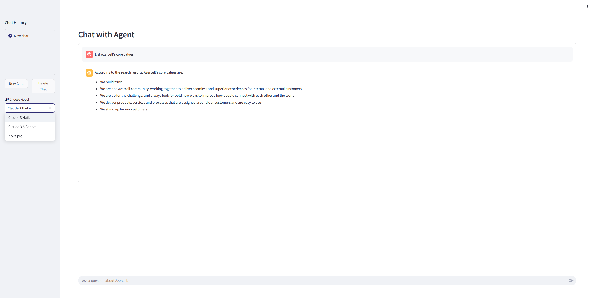

## Chatbot with Azercell's knowledge base
## 🖥️🔌 Main Interface


## 🚀 Quick Start

### 1 · Prerequisites

* [Docker ≥ 24](https://docs.docker.com/) & Docker Compose
*  AWS creds for Bedrock.

### 2 · Setup .env

* Create the `.env` file in the `backend/` folder. The `backend/.env.example` contains the template environment file.
* Add there the AWS access and secret keys with variable names `ACCESS_KEY` and `SECRET_KEY`, respectively.

### 3 · Clone & Run

```bash
git clone https://github.com/your-org/mcp-playground.git
cd mcp-playground
docker compose up --build
```

| Service | URL | Default Port | EC2 Deployed Link |
| ------- | --- | ------------ | ------------ |
| Streamlit Client | <http://localhost:8501> | `8501` | <http://3.212.39.114:8501/> |
| FastAPI Backend | <http://localhost:8000> | `8000` | <http://3.212.39.114:8000/> |
| FastAPI Backend Docs | <http://localhost:8000/docs> | `8000` | <http://3.212.39.114:8000/docs> |
---


## Development Setup

### For Server Deployment (Ubuntu)

1. **Add user to docker group** (to run docker commands without sudo)
   ```bash
   sudo usermod -aG docker ubuntu
   ```

2. **Add `backend/.env` file to the cloned repository** 
   ```
   ACCESS_KEY="access key from aws"
   SECRET_KEY="secret key from aws"
   ```

3. **Create GitHub self-hosted runner**
   - Go to your repository **Settings** → **Actions** → **Runners**
   - Click **"New self-hosted runner"** and select **Linux**
   - Follow all the setup steps provided by GitHub **except the last step**
   - Don't run `./run.sh` directly as shown in GitHub instructions

4. **Launch GitHub runner in detached mode**
   ```bash
   nohup ./run.sh > runner.log 2>&1 &
   ```


## ⚙️ Configuration

All runtime settings are concentrated in **`client/config.py`** and environment variables.

| Variable | Purpose |
| -------- | ------- |
| `MODEL_ID` | Provider selector (`Claude 3 Haiku`, `Claude 3.5 Sonnet`, `Nova pro`).

```python
MODEL_OPTIONS = {
    "Claude 3 Haiku": "anthropic.claude-3-haiku-20240307-v1:0",
    "Claude 3.5 Sonnet": "anthropic.claude-3-5-sonnet-20240620-v1:0",
    "Nova pro": "amazon.nova-pro-v1:0",
}
```

## 🙏 Acknowledgements

* [MCP Playground ](https://github.com/Elkhn/mcp-playground)  